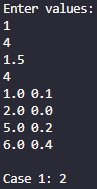

# Setup of Galactic bonding Problem

Homework 9.1 for CS5301

Tested working. 

### TODO
- Finalize comment markups
- Complete proof of correctness
---

## Params here:
---
Input to the program will be to standard input (cin). 
The number of tests T (T ≤ 50) is on the first line.

Each test case contains the number of stars N (0 ≤ N ≤ 1000) a real distance D (0.00 ≤ D ≤ 1000.00). 
The next  lines have a pair of real coordinates (X, Y) (− 1000.00 ≤ X, Y ≤ 1000.00) for each star.

Real numbers in the input will have at most two digits after a decimal point.

---
## Output:
---

Your program output should go to standard output (cout). For each test case output a single line “Case T: N.” Where T is the test case number (starting from 1) and N is the number of constellations.

---

## Sample runs:

> test run of Main.cpp

> 

> Sample input
```
2
5 1.5
1.0  0.1
2.0 0.0
5.0 0.2
6.0 0.4
3.0 -0.1
3  4.0
121.12  254.06
645.04  301.85
912.49  568.96
```
> Sample output 
```
Case 1: 2
Case 2: 3
```

> Sample input
```
1
5 1.5
1 -1
1.5 -1
1.5 0
1.5 1
1 1.5
```
> Sample Output
```
Case 1: 1
```

> Sample input
```
3
13 1.5
-1 0
-1.5 0
-2 0
-2.5 0
-3 0
1 -1
1.5 -1
1.5 0
1.5 1
1 1.5
3 2
4 3
5 4
7 1.5
-5 5
-5 4
-5 3
-3 4
-3 5
-2 4
-2 5
5 1.0
2 4
2 5
1 5
0 5
0 4
```
> Sample Output
```
Case 1: 3
Case 2: 2
Case 3: 1
```

> Sample input
```
1
4 1.0
-1.0 0
0 -1.0
1 0
0 1
```
> Sample Output
```
Case 1: 4
```